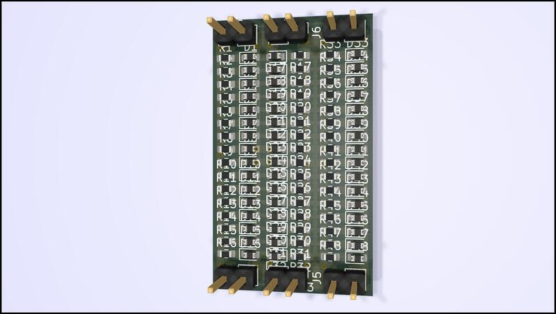
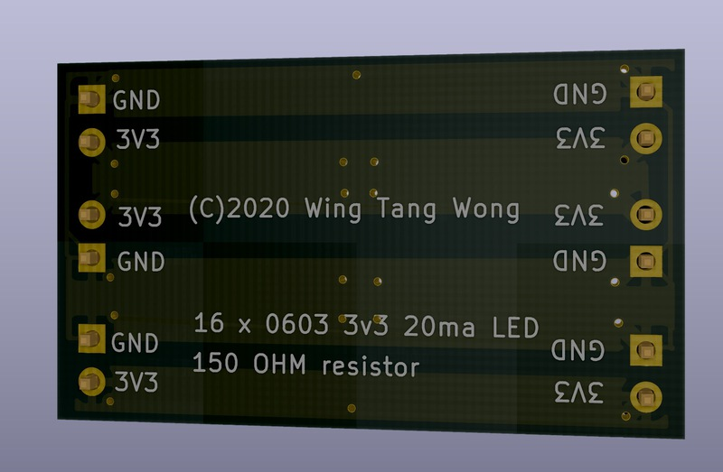

# LED-PANEL

A small LED panel. Designed with KiCad and files generated and placed into `MANUFACTURING` for production via [JLCPCB](http://www.jlcpcb.com/).

* 0603 white led with LSCS part numbers in the CSV and schematic files.
* 0603 150-ohm resistors ( limits current to around 15-20ma when powered at 3v3 )
* 3 x strips of 16 LED/RESISTOR pairs, in two groups.
* Common GND
* 2 x 3v3 groupings
* headers at head and tail of board to allow for chaining.
* 3V3 and GND paths run along front and back.

